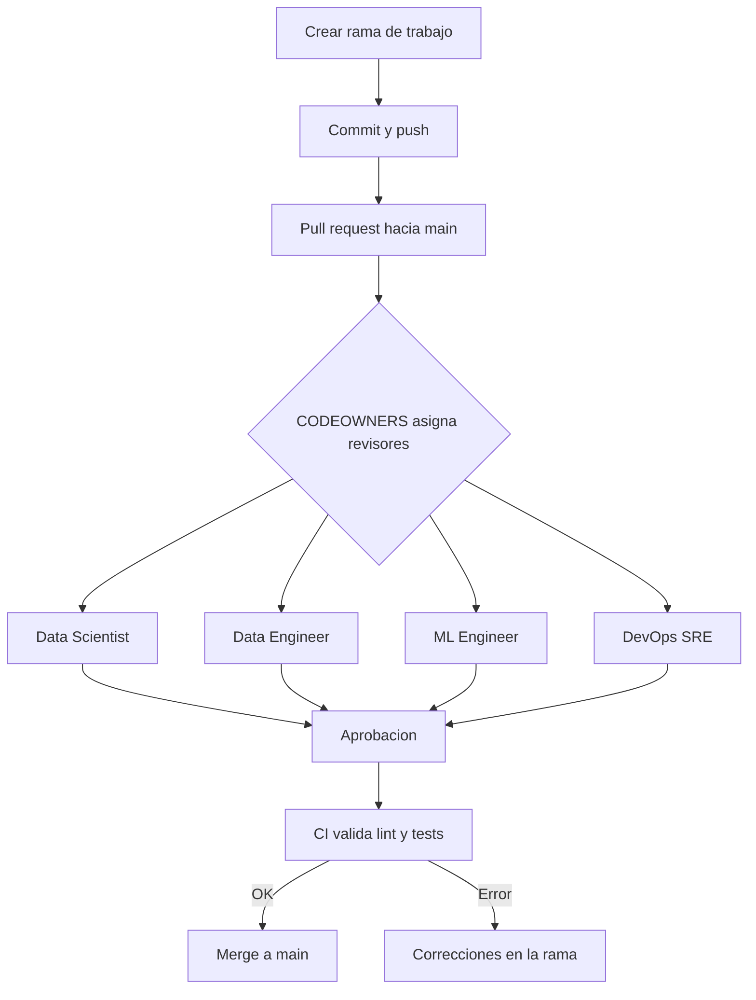
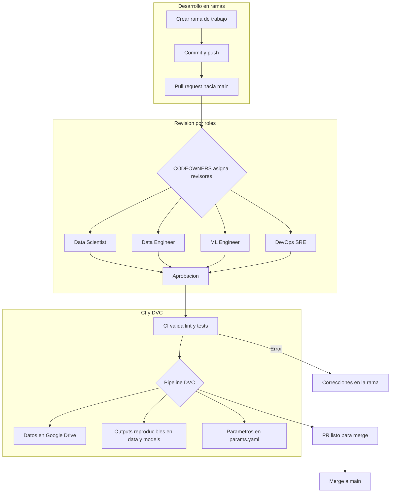

# 📂 Proyecto MLOps — Absenteeism at Work (Team 6)

Este repositorio contiene el proyecto de la asignatura de **MLOps**, utilizando el dataset _Absenteeism at Work_.  
El objetivo es aplicar prácticas de versionado de datos, exploración, limpieza y modelado de Machine Learning en equipo.

---

## 🚀 Setup del entorno

### 1. Clonar el repositorio

```bash
git clone https://github.com/vbravo-tec/mlops-absenteeism-team6.git
cd mlops-absenteeism-team6
```

### 2. Crear y activar entorno virtual

```bash
python -m venv .venv
.\.venv\Scripts\Activate.ps1
```

### 3. Instalar dependencias

```bash
pip install --upgrade pip
pip install -r requirements.txt

```

### 4. Congelar dependencias (solo si instalas algo nuevo)

```bash
pip freeze > requirements.lock.txt

```

## Estructura de datos (DVC)

El versionado de datos se realiza con DVC.
Los datasets NO se suben a GitHub, solo los punteros .dvc.

Carpetas principales:

data/
├── raw/ <- Datos originales y modificados (provistos por TA)
├── interim/ <- Datos intermedios (limpieza parcial, imputación, etc.)
├── processed/ <- Datos finales listos para modelado
└── external/ <- Datos de terceros (si se integran fuentes adicionales)

Ejemplo de datasets actuales:
data/raw/Absenteeism_at_work_original.csv
data/raw/Absenteeism_at_work_modificado.csv

## Remote de DVC (Google Drive)

El almacenamiento remoto está configurado en Google Drive.
Cada integrante debe ejecutar una sola vez:

```bash
dvc pull
```

Pasos al correr `dvc pull` por primera vez:

1. Se abrirá el navegador con la ventana de autenticación de Google.
2. Inicia sesión con tu correo institucional (el que fue autorizado).
3. Acepta los permisos.
4. DVC almacenará el token localmente (no se versiona).

## Flujo de trabajo con datos

### 1. Obtener datasets

```bash
git pull origin main
dvc pull
```

### 2. Crear nuevas versiones (ejemplo limpieza)

```bash
# generar dataset limpio en data/interim/
python mlops/dataset.py --task clean \
    --input data/raw/work_absenteeism_modified.csv.csv \
    --output data/interim/absenteeism_clean_v1.csv

# versionar con DVC
dvc add data/interim/absenteeism_clean_v1.csv
git add data/interim/absenteeism_clean_v1.csv.dvc
git commit -m "data(interim): primera versión de limpieza"
dvc push
git push origin <mi-rama>

```

### 3. Reproducir pipeline

```bash
dvc repro

```

## Convenciones del equipo

- **Ramas**:

  - Crear **una rama por tarea**  
    Ejemplos:
    - `data/cleaning-nulos`
    - `features/encoding`
    - `model/baseline-logreg`
  - Nunca trabajar directamente en `main`.

- **Merge a main**:

  - Solo vía **Pull Request (PR)**.
  - Cada PR debe incluir descripción clara de los cambios.

- **No subir datos a GitHub**:

  - Todos los datasets deben versionarse con **DVC**.
  - Usar siempre:
    ```bash
    dvc add <archivo>
    dvc push
    git add <archivo>.dvc
    git commit -m "data(...): descripción"
    git push origin <mi-rama>
    ```

- **params.yaml**:

  - Editar parámetros de limpieza, features, split y modelos aquí.
  - **Nunca** hardcodear valores en los scripts.

- **main protegido**:
  - No se permiten commits directos.
  - Solo se actualiza mediante **PR revisados y aprobados**.

## 👥 Roles y responsabilidades del equipo

| Rol                | GitHub User | Responsabilidades principales                                                                                                 |
| ------------------ | ----------- | ----------------------------------------------------------------------------------------------------------------------------- |
| **DevOps / SRE**   | @vbravo-tec | Configuración de CI/CD, versionado con DVC, pipelines (`dvc.yaml`, `params.yaml`), mantenimiento de infraestructura del repo. |
| **Data Scientist** | @A01795943  | Análisis exploratorio (EDA), creación y validación de features (`mlops/features.py`), experimentación en notebooks.           |
| **Data Engineer**  | @Joelrbtec  | Limpieza de datos, imputación, gestión de datasets (`mlops/dataset.py`, `/data/`), asegurar calidad de los datos.             |
| **ML Engineer**    | @Mike       | Construcción, entrenamiento y evaluación de modelos (`mlops/modeling/`), ajuste de hiperparámetros, métricas.                 |

📌 Todas las tareas deben hacerse en **ramas específicas por tarea** y ser integradas vía **Pull Request**.  
📌 GitHub solicitará revisión automática de acuerdo a este rol, gracias a la configuración en el archivo `CODEOWNERS`.

## 🔄 Flujo de Trabajo del Equipo



📌 **Cómo leerlo:**

1. Cada integrante trabaja en su rama (`data/...`, `features/...`, etc.).
2. Al abrir un **Pull Request**, GitHub asigna automáticamente revisores según `CODEOWNERS`.
3. El equipo revisa y aprueba → corre el **CI/CD**.
4. Si pasa, se hace merge a `main`.

## 🔄 Flujo de Trabajo con DVC Integrado



---

📌 **Explicación:**

1. Cada integrante trabaja en su rama y abre un Pull Request.
2. Los revisores se asignan automáticamente según `CODEOWNERS`.
3. El **CI/CD** valida que el código cumpla con reglas y que el **pipeline de DVC** corra.
4. DVC asegura que:
   - Los **datos crudos y derivados** están en **Google Drive (remote)**.
   - Los **outputs** (clean, features, modelos) son reproducibles.
   - Los **parámetros** se controlan en `params.yaml`.
5. Si todo pasa → se mergea a `main`.

---

## Docker para proyecto de entrenamiento (mlops-team6/mlops-absenteeism-team6)

Este Dockerfile permite ejecutar el pipeline de entrenamiento, regenerar el modelo y guardar los artefactos. Asume que tu proyecto tiene un script principal como train.py, src/train.py o similar.

---

## Dockerfile

```
# ============================
# Dockerfile - Training Pipeline con DVC
# ============================

FROM python:3.10-slim

ENV PYTHONDONTWRITEBYTECODE=1
ENV PYTHONUNBUFFERED=1

WORKDIR /app

# Instalar dependencias de sistema necesarias para DVC y compilación
RUN apt-get update && apt-get install -y --no-install-recommends \
    build-essential \
    git \
    && rm -rf /var/lib/apt/lists/*

# Copiar dependencias
COPY requirements.txt .

RUN pip install --no-cache-dir --upgrade pip && \
    pip install --no-cache-dir -r requirements.txt

# Copiar el código completo
COPY . .

# Comando para reproducir el pipeline DVC
CMD ["dvc", "repro"]
```

---

## Construir la imagen

docker build -t mlops-train:latest .

---

## Ejecutar el contenedor

docker run --rm -v ${PWD}:/app mlops-train:latest

Esto permite que los modelos, logs o métricas queden guardados fuera del contenedor.

---

## Subir a DockerHub

### 1. Inicia sesión en Docker Hub

docker login

### 2. Etiqueta la imagen local para Docker Hub

docker tag mlops-train:latest mlops-team6/mlops-train:latest
docker tag mlops-train:latest mlops-team6/mlops-train:1.0.0

### 3. Sube la imagen al repositorio de Docker Hub

docker push mlops-team6/mlops-train:latest
docker push mlops-team6/mlops-train:1.0.0
